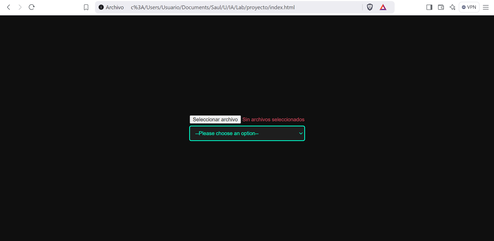
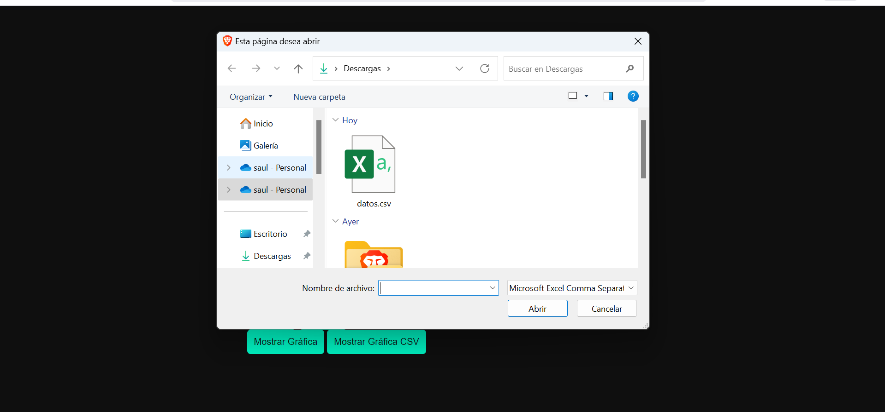
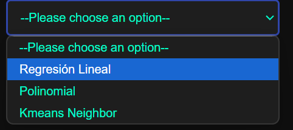
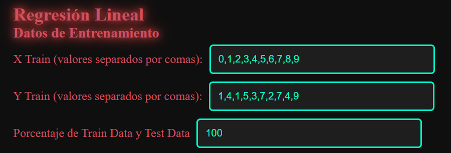
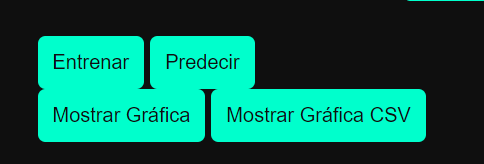
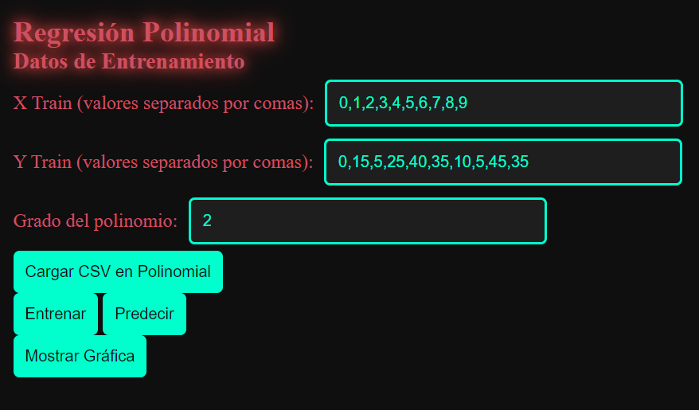
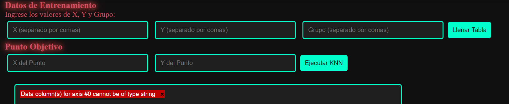
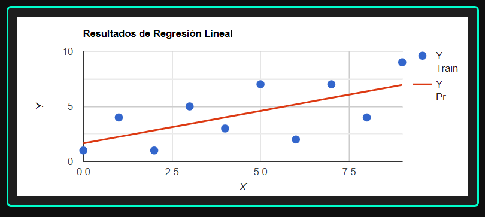
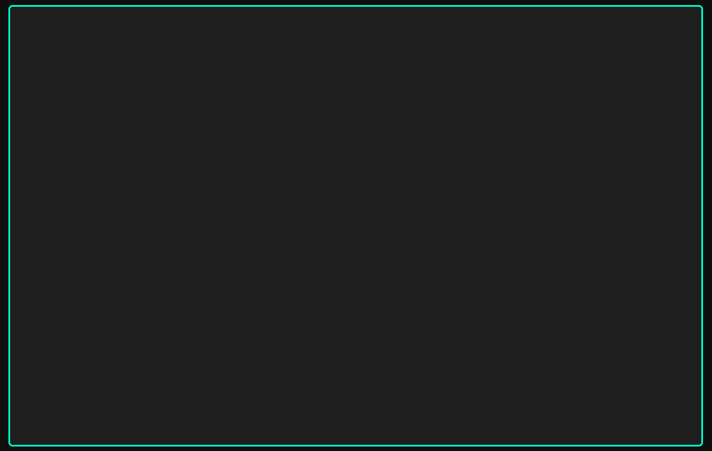

# **Manual Técnico**
##### ***INTELIGENCIA ARTIFICIAL 1***
___

## **INDICE**
- [**RESPONSABLES**](#responsables)
- [**ACERCA DE**](#acerca-de)
- [**USO**](#USO)

___
## **RESPONSABLES**

|No.| Nombre | Carnet |
|:-:| ------ | ------ |
|2| Saúl Jafet Menchú Recinos | 201906444 |
___
## **ACERCA DE**
En este proyecto se detalla la implementación y funcionamiento de un programa en `JS` usando la libreria Tytusjs para el uso de Machine Learning.

___
## **USO**
A continuación se detalla el uso del programa para cualquier usuario que esté interesado en probarlo.

En un inicio el usuario encuentra la opción de selección de archivo de carga para el CSV y la selección de modelo a utilizar.

  

Si el usuario selecciona la carga de archivos, se abrirá un seleccionador para escoger la entra de datos para probar en los modelos disponibles

  

En caso de abrir la selección se le mostrará tres opciones, las siguientes.

  

Si el usuario selección la opcion de lineal, encontrará 3 inputs para el ingreso de datos en la columna X, Y y el porcentaje de datos a usar

  

Luego encuentra los botones, que dependiendo del uso de archivo CSV, tendrá que seleccionar los botones correspondientes o no.

  

Para el caso del modelo lineal, la única diferencia que encontrará sera el input para el rango a elegir

  

En el caso de K Means Neighbor, encontrará mas campos de entrada, ya que este algoritmo es el más complejo de los 3.

  

En cual quiere que fuera el caso para lineal y polinomial, esta generará una grafica para mostrar los resultados.

  

En caso de K Means solo mostrará el resultado en texto.

  

Ese sería el flujo del programa para que usuario pueda probar los 3 algoritmos.

____